# Happy Days Remix/Supabase Sass

Happy days is an open-source sass application built using the power of Supabase's Postgres database, combined with the speed of Remix on the front end.

Happy days was built by the Supabase team and community during Supabase's Super Happy, Happy Hour, every thurday starting 5:00 pm Pacific Standard Time, 9:00 pm Eastern Standard Time.

**<u>Happy Hour </u>**

#

To follow along from the beginning to the deployment click the youtube link below starting with happy hour #10. 

Or join the community  to build more cool stuff every Thursday @ 5:00 pm PST, 9:00 pm EST live on YouTube!


[YouTube/Playlist](https://www.youtube.com/playlist?list=PL5S4mPUpp4OvS_lW6OGX2NTiQ_AHAQ3t-)

[Happy Hour Party](https://www.youtube.com/c/Supabase) (Thursday, 5:00 pm PST - 9:00 EST)


#
### <u> Important Note! </u> (UPDATE TO HAPPY HOUR 17)


<p>Use a reference guide and notes. Everything has not been fully tested to insure 
out and ensure things are bug-free and correct. Fallow along with youtube.
Don’t drive yourself
crazy debugging because there are probably some errors. Use as notes,
and check work. Let me know if there are any problems or add to your own
notes.</p>

### ACCOUNTS REQUIREMENTS AND TECHNOLOGIES USED

#
#### Accounts
-  Supabase free account [Supabase](https://supabase.com/)
-  Cloudflare workers account [Cloudflare](https://dash.cloudflare.com/sign-up/workers)
-  GitHub account [GitHub](https://github.com/)
-  Stripe account [Stripe](https://dashboard.stripe.com/register)


#### Technologies
-  Remix [Remix](https://remix.run/)
-  Supabase [Supabase](https://supabase.com/)
-  Supabase Auth [Supabase Auth](https://supabase.io/docs/reference/javascript/auth-signup)
- Supabase Storage [Supabase Storage](https://supabase.io/docs/reference/javascript/storage-upload)
-  Supabase Postgres [Supabase Postgres](https://supabase.io/docs/reference/javascript/postgres)
- Supabase Edge Functions [Supabase Edge Functions](https://supabase.io/docs/guides/with-edge-functions)
## CHEATSHEET

#

 Copy and paste these references into to a text editor for easy access. If you know where to find these references start gathering them. This will save time because you time, many of these references will be use many times. Below will be be a more detailed explanation of each reference.


### <u> Supabase </u>

- SUPABASE_PROJECT_REF=

- SUPABASE_URL =

- SUPABASE_ANON_KEY=


### <u> GitHub </u>
- CLIENT ID=
- SECRET=

### <u> Stripe variables used by edge functions </u>
-STRIPE_SIGNING_SECRET= 
- STRIPE_KEY=

### <u> .env file  </u>
- STRIPE_SECRET=

### <u> wrangler.toml</u>

- SUPABASE_URL =

- SUPABASE_ANON_KEY=


## Setting up backend with Supabase Auth using GitHub as the provider
#

**<u>SUPABASE REFERENCES</u> (Copy these to note pad will be used many
times in the guide)**

**(See screenshots below as a visual reference to locate)**

-  Supabase URL (supabase/settings/api)

-  Supabase Anon Key (Supabase/setting/api)

-  Supabase Project Ref (supabase/settings/api)

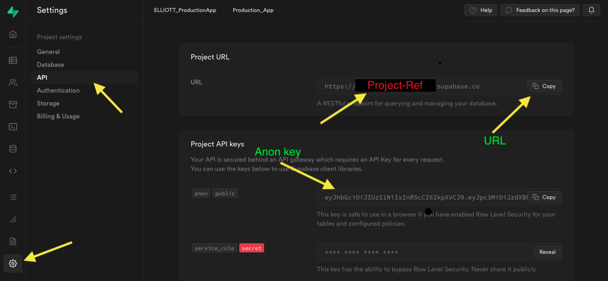

**<u>SUPABASE GITHUB AUTH PROVIDER (GITHUB SETUP)</u>**

-  In your GitHub profile, on the right side of the nav bar, go to
   Settings / Developer Settings / OAuth apps

-  Register a New OAuth application

-  Name: your choice

-  Homepage URL = Supabase URL

-  Authorization Callback = Supabase URL + / auth/v1/callback

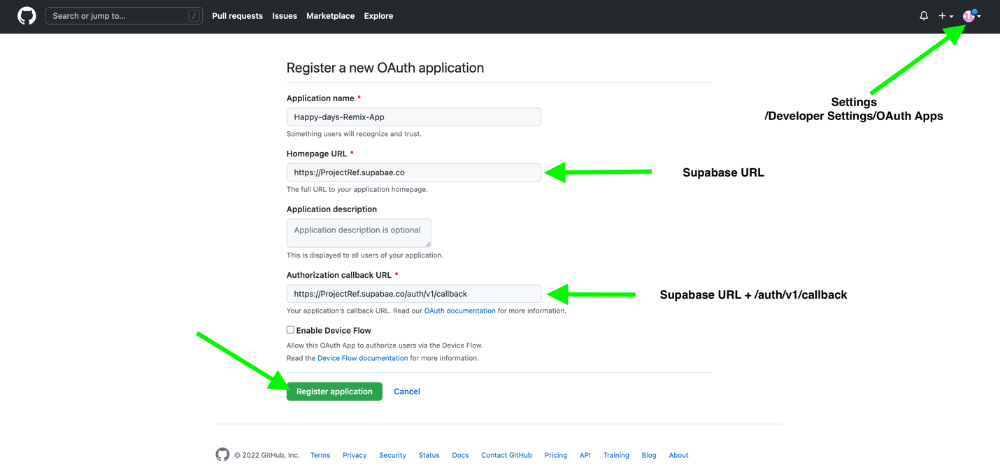

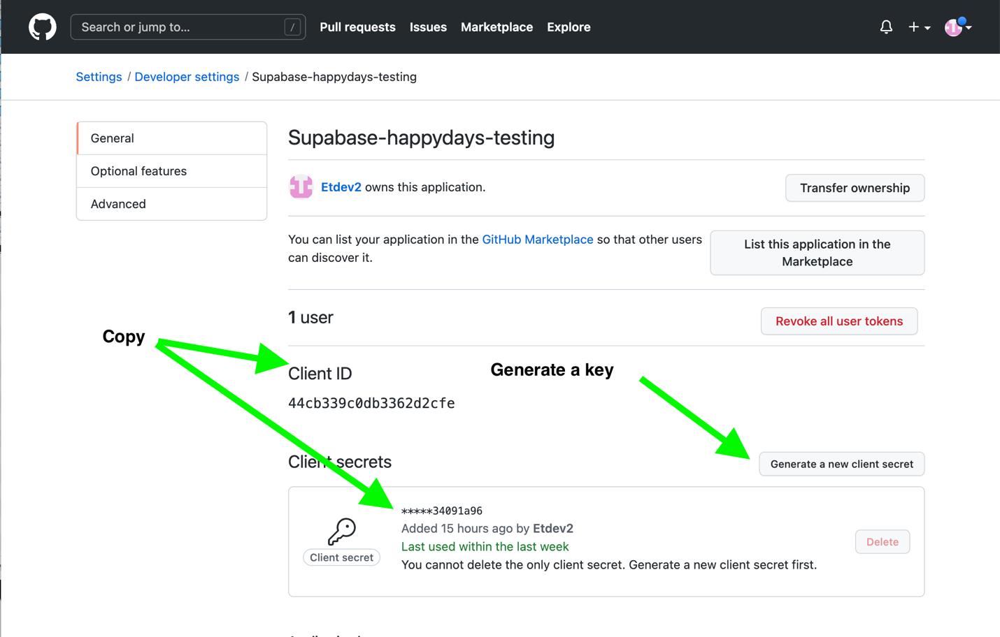

**<u>SUPABASE GITHUB AUTH PROVIDER (SUPABASE SETUP)</u>**

-  After setting up GitHub OAuth copy **Client ID** AND copy the
   generated **client secrete**

-  Got to Supabase Dashboard and go to pages
   Supabase/Authentication/Settings/ and scroll down to Auth Providers

-  Enable GitHub, Paste in Client ID, and Client secret and save

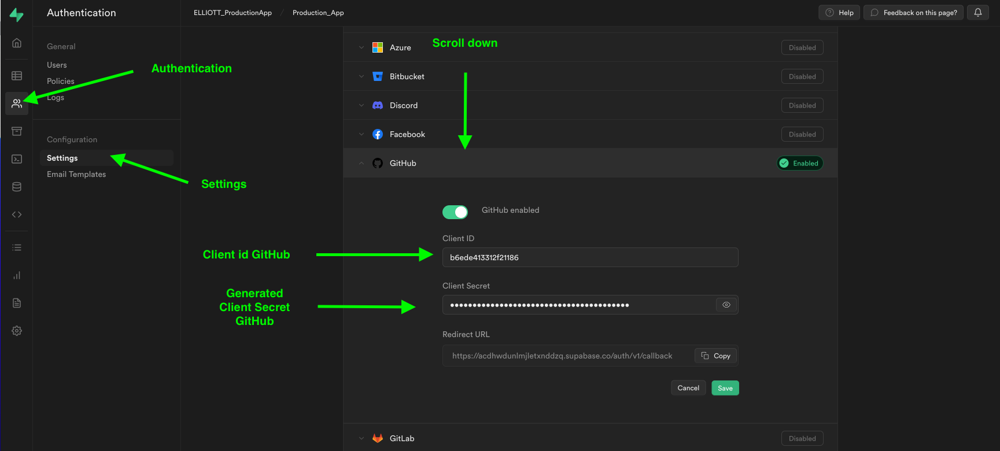

## Manually cloning project from GitHub 
#

-  [**https://github.com/dijonmusters/happy-days**](https://github.com/dijonmusters/happy-days)

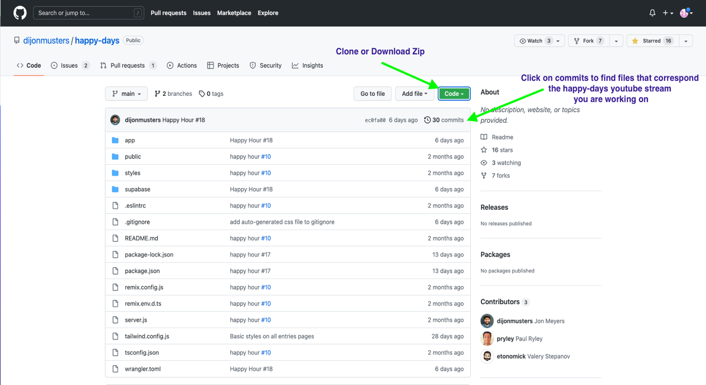


## Setting up Supabase keys 
#

### <u> Setting up Supabase keys in wrangler.toml </u>


-  In wrangler.toml under vars replace SUPABASE_URL and SUPABASE_ANON_KEY
   with your superbase keys found in the dashboard.

-  Continue with VS code and remix after the database is configured.

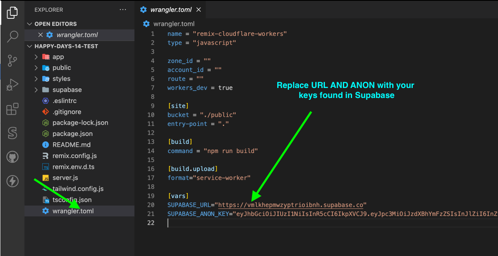

## Setting database tables in Supabase
#

### <u> Manually setting up tables in Supabase </u>
-  Create an entries table and user_data table (Manually or with the SQL
   code bellow)

**Entries AND user_data**

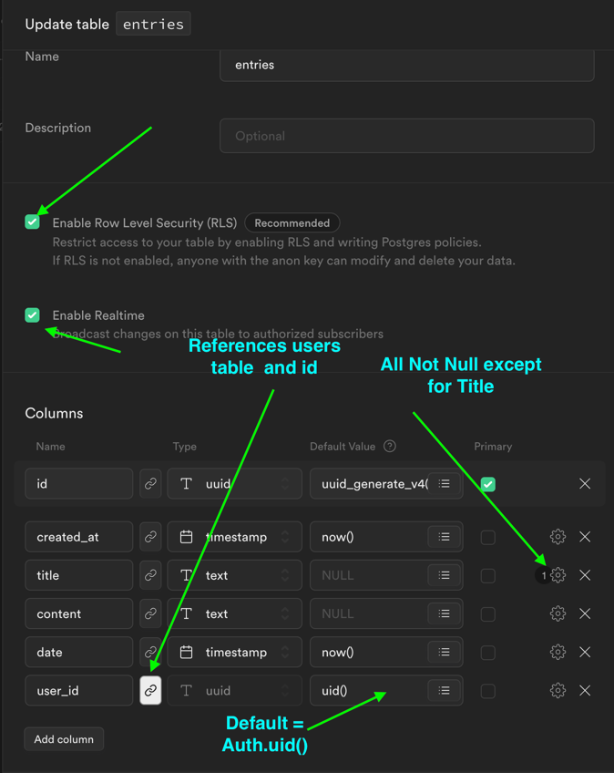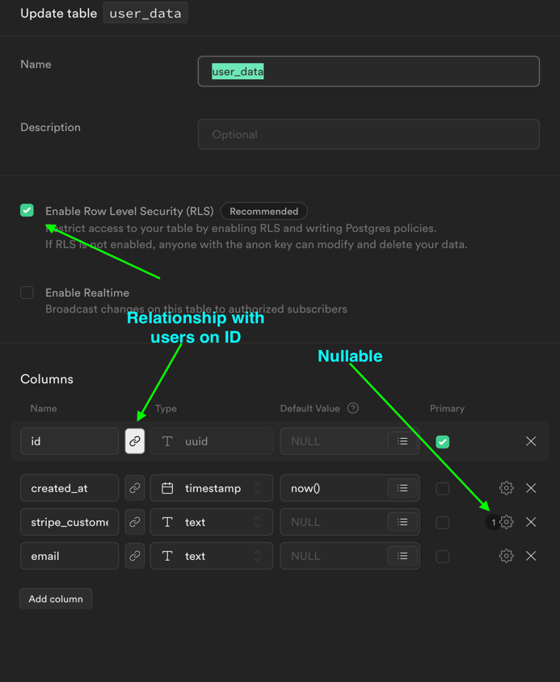

### **<u>SETUP SUPABASE WITH THE SQL</u>**
#

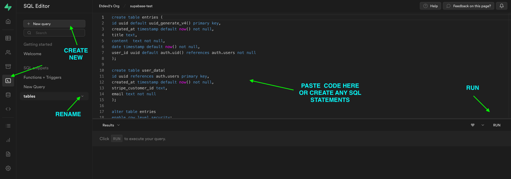

**<u>CREATING A TYPE THAT DOES NOT EXIST IN SUPABASE WITH SQL</u>**

-  **RUN first in a separate query.**
```sql

   create type subscription_tier as enum('FREE','STADARD','PREMIUM')
```
#

**<u>Full SQL (Tables, function, triggers)</u>**

-  **Run either FULL SQL or SQL FOR TABLES AND POLICIES.**

-  **Manually Add \[\] as default. For the assets_url column**


```sql 
create table entries (
  id uuid default uuid_generate_v4() primary key,
  created_at timestamp default now() not null,
  title text,
  content  text not null,
  date timestamp default now() not null,
  user_id uuid default auth.uid() references auth.users not null,
  asset_urls text []  not null
);

create table user_data
 (
    id uuid references auth.users primary key,
    created_at timestamp default now() not null,
    stripe_customer_id text,
    email text not null,
    subscription_tier   subscription_tier default 'FREE' not null
 );

alter table entries
  enable row level security;

CREATE POLICY "Authenticated users can see their own entries" ON "public"."entries"
AS PERMISSIVE FOR SELECT
TO authenticated
USING (user_id = auth.uid());

CREATE POLICY "users can update their entry" ON "public"."entries"
AS PERMISSIVE FOR UPDATE
TO authenticated
USING (user_id = auth.uid())
WITH CHECK (user_id = auth.uid());

CREATE POLICY "Authenticated users can insert own data" ON "public"."entries"
AS PERMISSIVE FOR INSERT
TO authenticated
WITH CHECK (user_id = auth.uid());

alter table user_data
  enable row level security;  

create function public.handle_new_user()
returns trigger as
$$
begin
  insert into public.user_data(id,email)
  values(new.id,new.email);
  return new;
end;

$$
language plpgsql security definer;

create trigger on_insert_auth_user
  after insert on auth.users
  for each row
    execute procedure public.handle_new_user();  

```

**<u>Run Remix to create a new user trigger.</u>**

-  If you have not cloned the repository, follow the directions above.

-  Before starting make sure you competed (OAuth, Created tables
   (entries, user_data, RLS)

-  From the cloned repository replace SUPABASE_KEY and Anon_key in
   wangler.toml.

-  RUN npm install to install packages, npm audit fix to install
   dependencies

-  RUN npm run dev to check if OAuth works

-  If a user is created the user will show up in the database in
   supabase/authentication/users.

-  If the user is created continue to set up a function, that creates a
   user in the user_data table, trigged by the login.

**<u>SETTING UP FUNCTIONS AND TRIGGERS (MANUALLY)</u>**

-  In the supabase dashboard go to Supabase/ Database / In the menu
   below, you will see Triggers / Functions and Database Webhooks.

-  Create the handle_new_users function first

-  After the function is created you can connect the handle_new_users
   function to the on_insert_auth_user trigger. To connect the
   trigger-function use the drop-down menu “functions to trigger” in the
   trigger and you will see the function handle_new_users.

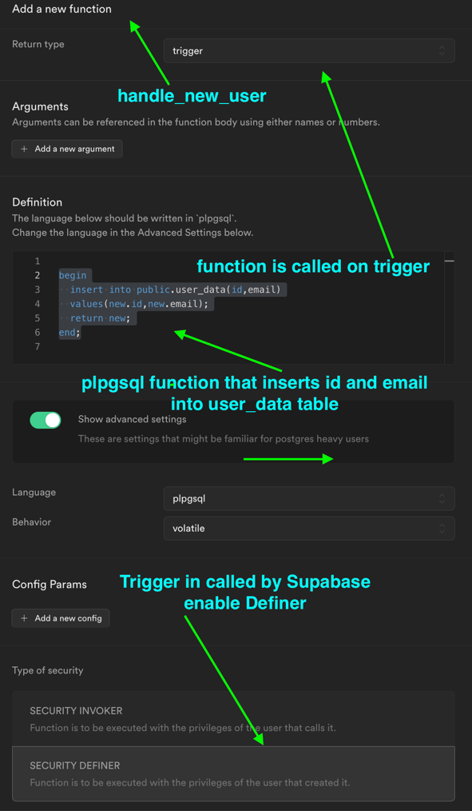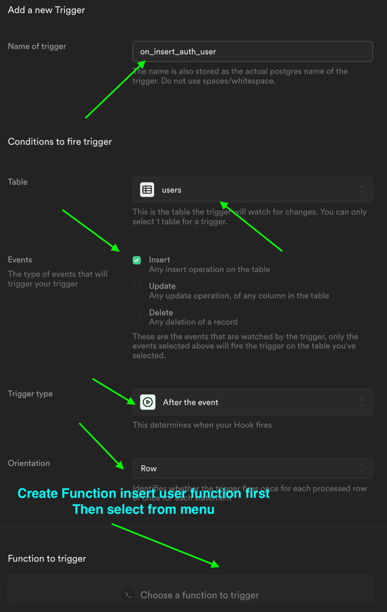

**<u>SETTING UP FUNCTION + TIGGER IN SQL EDITOR</u>**
```sql 
create function public.handle_new_user()
returns trigger as
$$
begin
  insert into public.user_data(id,email)
  values(new.id,new.email);
  return new;
end;

$$
language plpgsql security definer;

create trigger on_insert_auth_user
  after insert on auth.users
  for each row
    execute procedure public.handle_new_user();  
```

**<u>Removing user data to triggers, functions, Edge functions</u>**

-  **REMOVE all the user data from the supabase including the user before
   testing the trigger**

-

-  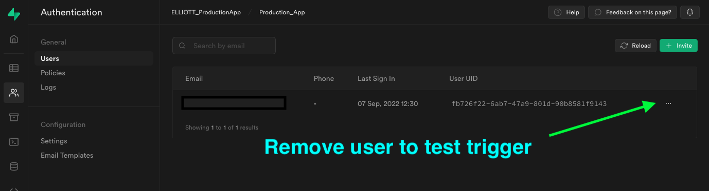

<!-- -->

-  **RUN npm run dev**

-  If everything is working properly after signing in to the remix app. A
   user with user_id will be written into the user_data base with
   stripe_customer null.

-  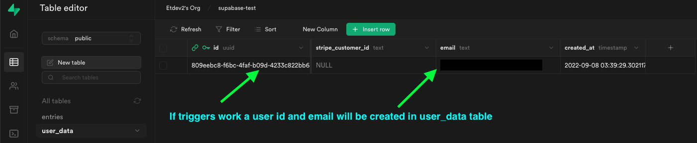

## **<u>SETUP STORAGE</u>**
#

-  **Create a new storage bucket named assets**

-  **Allow all operations**

-  **Added the below definitions in Storage policies**

> bucket_id = 'assets'
>
> and auth.uid()::text = (storage.foldername(name))\[1\]

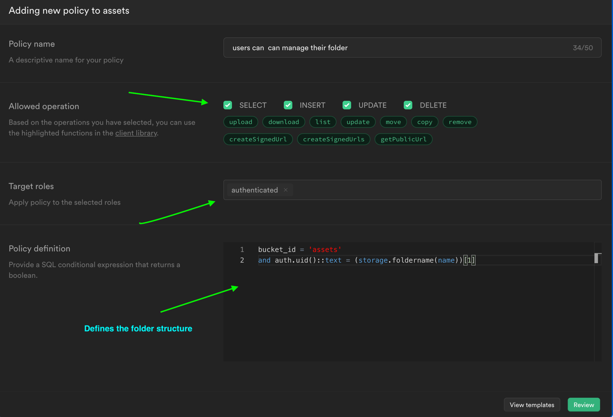

**<u>Storage File Structure Defined by policy</u>**

    Assets/

     /user uuid

            / entries uuid
      
                  /supabeats.mp3
      
      
       /user2 uuid
      
            /entries uuid
      
                  /Dog-pic.png

#
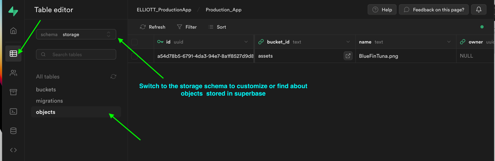
#

### SUPABASE EDGE FUNCTIONS AND SUPABASE CLI (Run Code In Vscode)
#
Terminal Exclude Run In The Terminal**)**

**STEPS TO THE EDGE**

Follow the steps below are more detailed (You will have to mess around
with things because sometimes the functions will not work as expected
when adding **DATABASE WEBHOOKS**) The steps are how all the functions will be created using supabase cli

1. **If you forked or cloned happy-days repository. Then Remove
   index.ts from the supabase folder, place it somewhere or copy code
   from the clipboard.**

**(Run the following in the terminal)**

2.  ```supabase init```

3. ```supabase link```

4. ```supabase functions new create-stripe-customer```

5. ```supabase functions deploy create-stripe-customer```

6. `curl -L -X POST invoke the function`

7. Create database webhook in supabase

8. **Add back the code form index.ts from the create-stripe-custom
   folder**

9. **Deploy supabase edge function again**

10.   **If there are users in the database, delete users.**

11.   **`Npm run dev` and login**

12.   **If the user is found in user_data with stripe_customer_id = null
      triggers are working continue and remove all user data from auth and
      user_data table again.**

13.   **Kill server**

14.   `supabase secretes list`

15.   **`supabase secrets set STRIPE_KEY = sk_1234`

16.   `supabase secretes list ` again and check**

17.   **Copy code from code in supabase/functions/index from Happys-14
      repo (the first function on top of index starts with const stripe =
      stripe(Deno.env.get....)**

18.   `supabase functions deploy create-stripe-customer`

19.   **Finally, npm run dev, start server, log in. If no errors
      everything probably works, check in supabase dashboard in the
      user_data table to see if the user was created with a
      stripe_customer_id, if yes, then a customer will be inserted into
      the stripe dashboard.**

-  [**https://supabase.com/docs/guides/cli**](https://supabase.com/docs/guides/cli)

-  Move temperately create-stripe-customer out of the superbase file
   before creating the edge function.

-  RUN `supabase INIT`

-  RUN `supabase link --project-ref` \[Project-ref\]

-  After linking the project you can exclude your project ref when
   deploying the edge function

-  RUN `supabase functions new create-stripe-customer` (<u>Creates a new
   edge function</u>)

-  RUN `supabase functions deploy create-stripe-customer --project-ref`
   \[project-ref\] ( <u> deploys the edge function</u>)

-  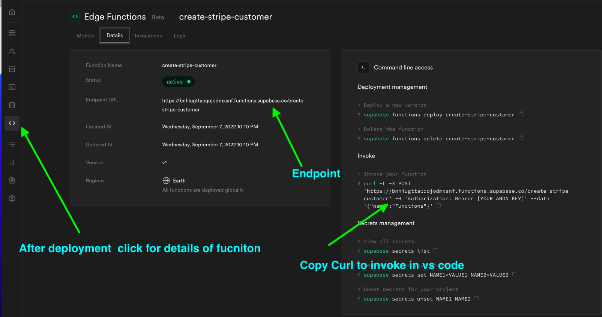

-  RUN `curl -L -X POST 'https://
   \[project-ref\].functions.supabase.co/create-stripe-customer' -H
   'Authorization: Bearer Anon_Key --data '{"name":"Functions"}'` ( <u>Invokes the functions</u>)

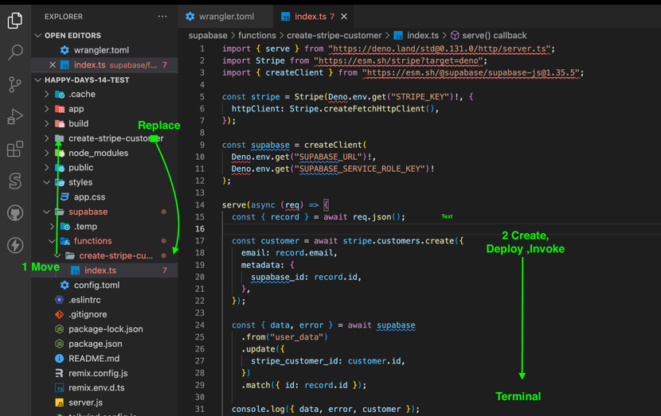

-  Replace the create-stripe-customer folder, that was moved earlier in
   vs code

**<u>CREATE A STRIPE SECRET KEY THAT CAN BE CALLED BY FUNCTION</u>**
#

-  Create a stripe account

-  In stripes developer dashboard copy secrete key

-  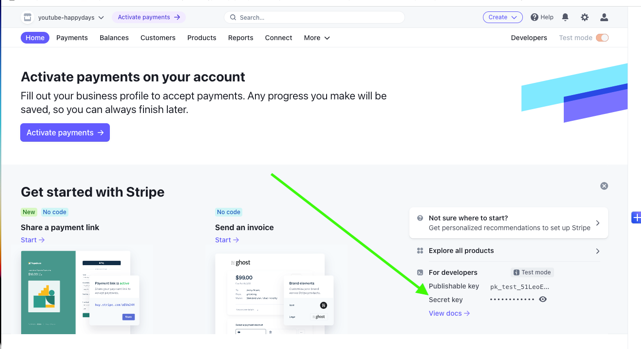

-  In vscode terminal Run: **supabase secrets list** (get a list of keys
   stored in supabase)

-  To set stripe key in Supabase Run: **supabase secrets set**
   **STRIPE_KEY =sk_1234** in terminal

-  Run: **supabase secrets list** to check if stripe key was stored

**<u>CREATE A SUPABASE DATABASE WEBHOOK</u>**
#

-  **Setting up this webhook, there is you could run into problems, I
   don’t know why but I had issues, getting everything to get these
   working. Everything was right but a customer stripe id would not be
   created. So you may need to tweak things around**

-  Create a webhook to call the Edge function that will create a stripe
   customer in stripe and in supabase when a new user is inserted into
   the database.

-  Delete user_data run npm run dev, login and if everything works you
   should have created a stripe customer in user_data and stripe
   dashboard

> 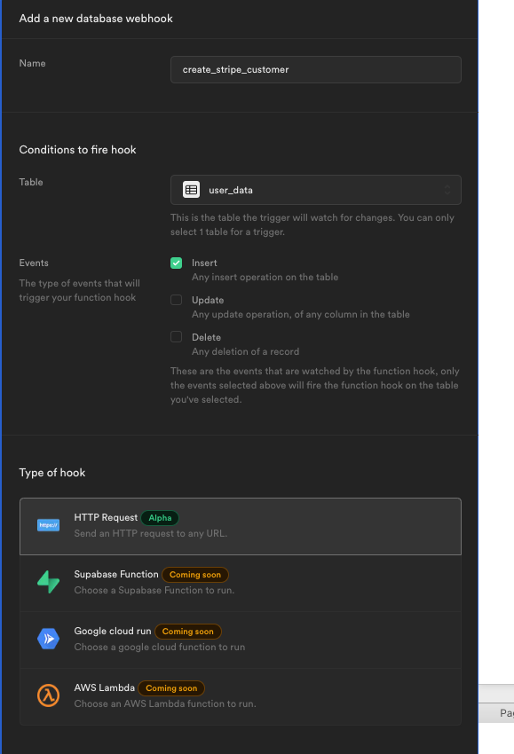 alt="Graphical user interface, text, application Description automatically generated" />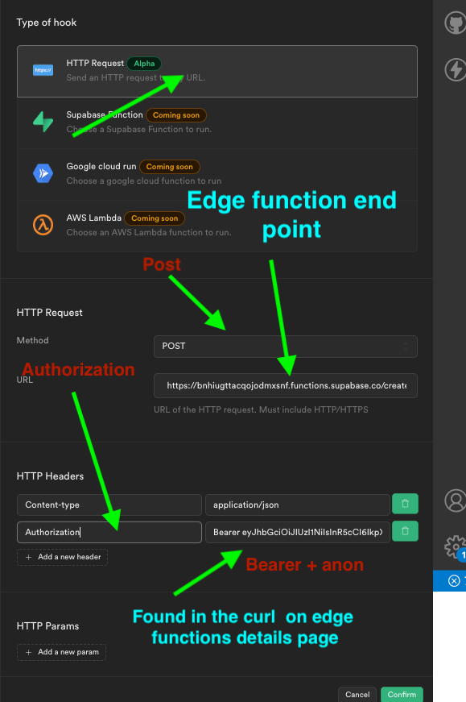 alt="Graphical user interface, application, website Description automatically generated" />

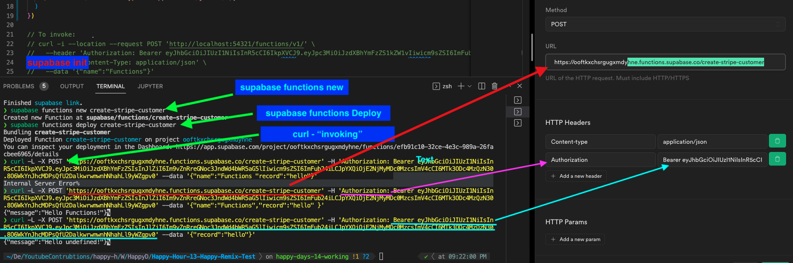

**MORE STRIPE**
#


**<u>ADD STRIPE PRODUCT</u>**

      Free/standard/premium

      RECURRING MONTHLY

      $0 |$4.99 |$9.99


#

## Supabase Edge functions used in happy Days

Using the `supabase functions new  [function name]`      

      create-stripe-customer  

      create-stripe-checkout 

      create-stripe-webhooks

#
### Documentation
-  Supabase free account [Supabase](https://supabase.com/)
-  Cloudflare workers account [Cloudflare](https://dash.cloudflare.com/sign-up/workers)
-  GitHub account [GitHub](https://github.com/)
-  Stripe account [Stripe](https://dashboard.stripe.com/register)
- Supabase CLI [Supabase Cli](https://supabase.com/docs/guides/cli)
-Supabase Edge functions [Supabase Edge functions](https://supabase.com/docs/guides/functions)