# HAPPY DAYS README GUIDE

#### Note!

**Use a reference guide and notes. I haven’t had time to test everything out and ensure things are bug-free and correct. So don’t drive yourself crazy debugging because there are probably some errors. Use as notes, and check work. Let me know if there are any problems or add your own notes.**

## ACCOUNTS REQUIREMENTS
· Supabase free account
· Cloudflare workers
· GitHub

## SUPABASE REFERENCES 
(Copy these to note pad will be used many times in the guide)

(See screenshots below as a visual reference to locate)

· Supabase URL (supabase/settings/api)
· Supabase Anon Key (Supabase/setting/api)
· Supabase Project Ref (supabase/settings/api

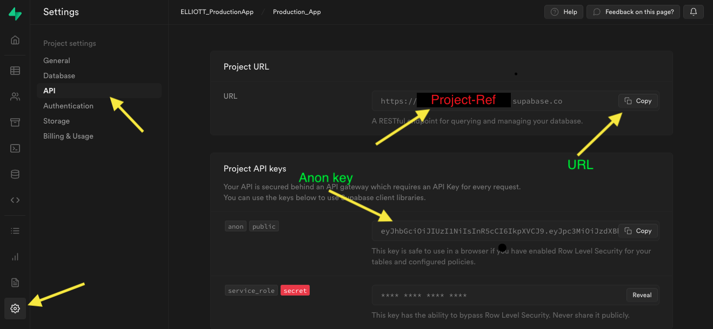

## SUPABASE GITHUB AUTH PROVIDER 
#### (GITHUB SETUP)

⦁	 In your GitHub profile, on the right side of the nav bar, go to Settings / Developer Settings / OAuth apps
⦁	Register a New OAuth application 
⦁	Name: your choice
⦁	 Homepage URL = Supabase URL
⦁	Authorization Callback  = Supabase URL + / auth/v1/callback

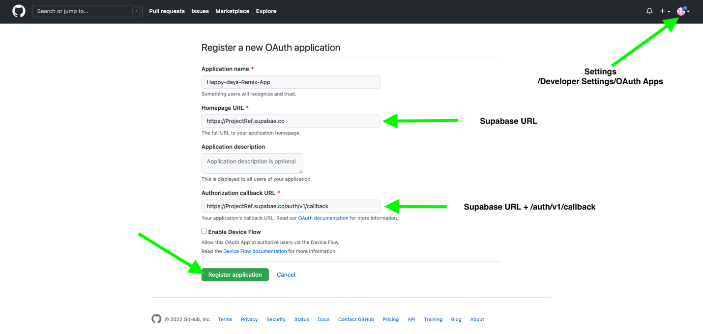
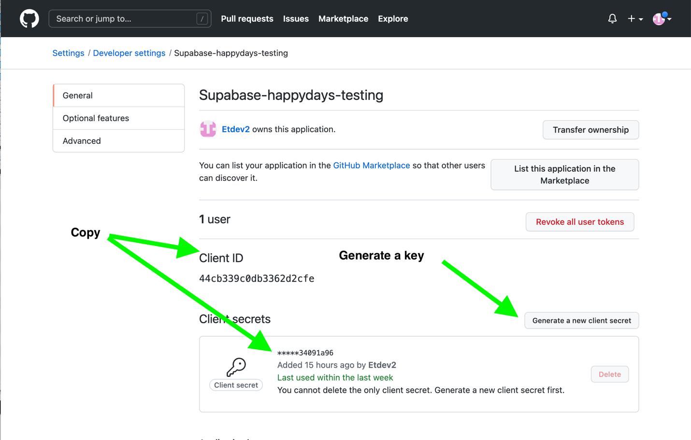

## SUPABASE GITHUB AUTH PROVIDER 
#### (SUPABASE SETUP)

⦁	After setting up GitHub OAuth copy Client ID AND copy the generated client secrete 
⦁	Got to Supabase Dashboard and go to pages Supabase/Authentication/Settings/ and scroll down to Auth Providers
⦁	Enable GitHub, Paste in Client ID, and Client secret and save

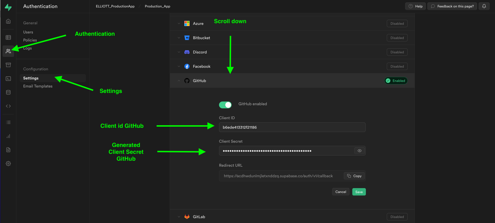

## CLONING PROJECT FORM GITHUB 
[Happy Days Github](https://github.com/dijonmusters/happy-days)

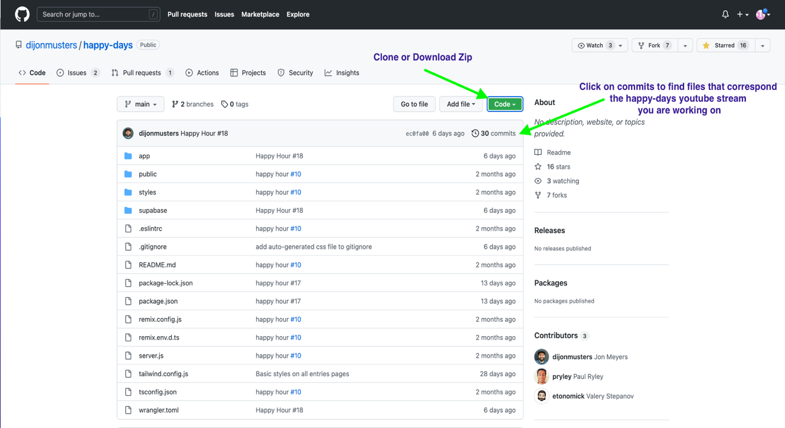

## SETTING SUPABASE KEYS .WRANGLER
⦁	In wrangler.toml under vars replace SUPABASE_URL and SUPABASE_ANON_KEY  with your superbase keys found in the dashboard. 
⦁	Continue with VS code and remix after the database is configured.

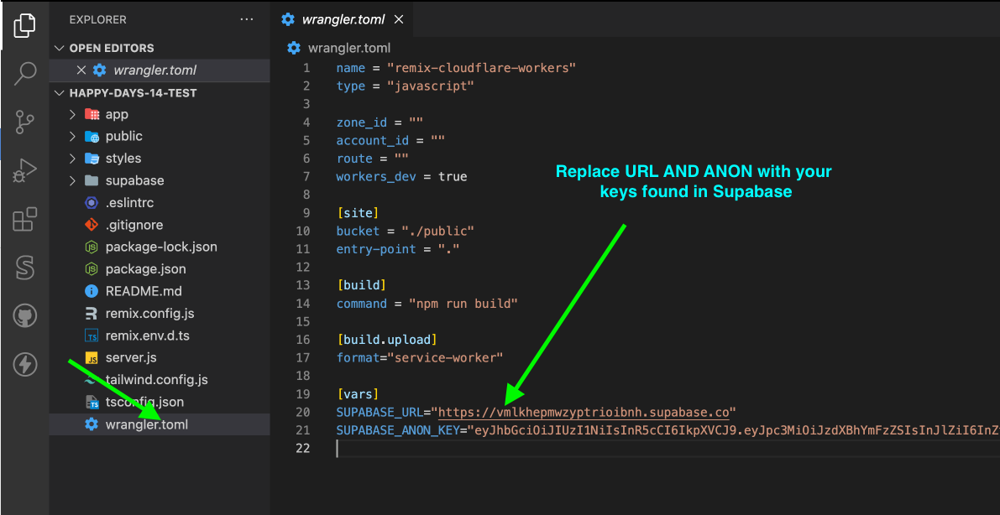

## SETTING UP DATABASE 
⦁	Create an entries table and user_data table (Manually or with the SQL code bellow)


#### Entries AND user_data 
<p float="left">
  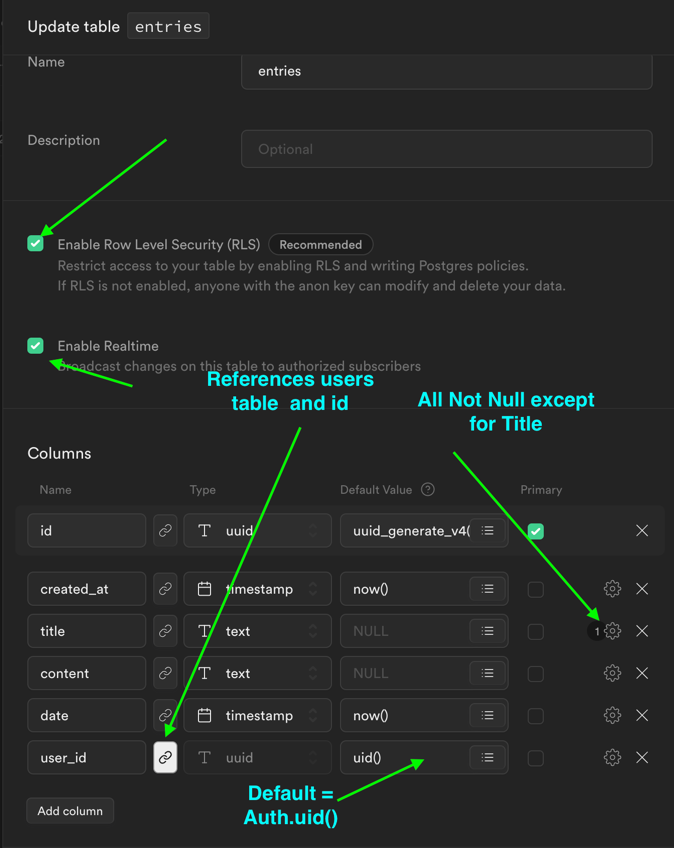
  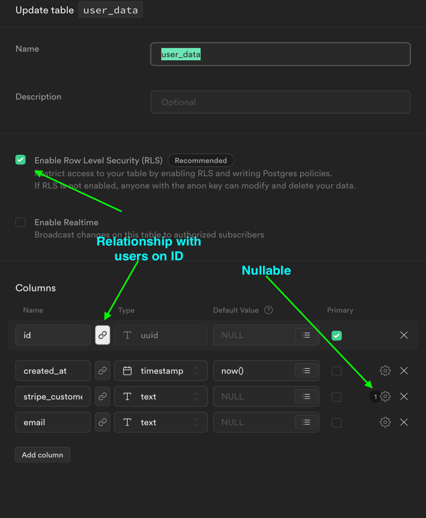 
</p>


#### SETUP SUPABASE WITH THE SQL
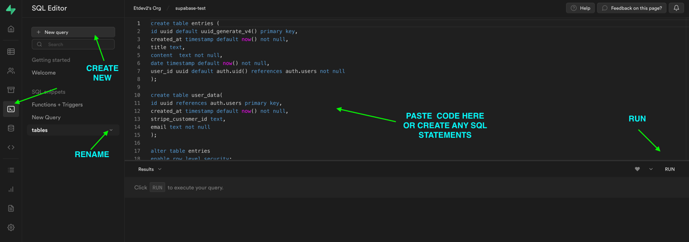

## CREATING A TYPE THAT DOES NOT EXIST IN SUPABASE WITH SQL
⦁	RUN first in a separate query.

``` sql
create type subscription_tier as enum('FREE','STADARD','PREMIUM')
```

#### Full SQL (Tables, function, triggers)
⦁	Run either FULL SQL or SQL FOR TABLES AND POLICIES.
⦁	Manually Add [] as default. For the assets_urls column 

``` sql
create table entries (
  id uuid default uuid_generate_v4() primary key,
  created_at timestamp default now() not null,
  title text,
  content  text not null,
  date timestamp default now() not null,
  user_id uuid default auth.uid() references auth.users not null,
  asset_urls text []  not null
);
```

``` sql
alter table entries
  enable row level security;
```

``` sql
CREATE POLICY "Authenticated users can see their own entries" ON "public"."entries"
AS PERMISSIVE FOR SELECT
TO authenticated
USING (user_id = auth.uid());
```

``` sql
CREATE POLICY "users can update their entry" ON "public"."entries"
AS PERMISSIVE FOR UPDATE
TO authenticated
USING (user_id = auth.uid())
WITH CHECK (user_id = auth.uid());
```

``` sql
CREATE POLICY "Authenticated users can insert own data" ON "public"."entries"
AS PERMISSIVE FOR INSERT
TO authenticated
WITH CHECK (user_id = auth.uid());
```

``` sql
alter table user_data
  enable row level security;
```

``` sql
create function public.handle_new_user()
returns trigger as
$$
begin
  insert into public.user_data(id,email)
  values(new.id,new.email);
  return new;
end;
$$
language plpgsql security definer;
```

``` sql
create trigger on_insert_auth_user
  after insert on auth.users
  for each row
    execute procedure public.handle_new_user();  

```

#### SQL FOR TABLES and POLICES  Only (user_data, and entries)  
⦁	Run will have to manually add handle_new_user function and on insert 

``` sql
create table entries (
id uuid default uuid_generate_v4() primary key,
created_at timestamp default now() not null,
title text,
content  text not null,
date timestamp default now() not null,
user_id uuid default auth.uid() references auth.users not null
);
```

``` sql
create table user_data(
id uuid references auth.users primary key,
created_at timestamp default now() not null,
stripe_customer_id text,
email text not null
);
```

``` sql
alter table entries
enable row level security;
```

``` sql
CREATE POLICY "Authenticated users can see their own entries" ON "public"."entries"
AS PERMISSIVE FOR SELECT
TO authenticated
USING (user_id = auth.uid());
```

``` sql
CREATE POLICY "users can update their entry" ON "public"."entries"
AS PERMISSIVE FOR UPDATE
TO authenticated
USING (user_id = auth.uid())
WITH CHECK (user_id = auth.uid());
```

``` sql
CREATE POLICY "Authenticated users can insert own data" ON "public"."entries"
AS PERMISSIVE FOR INSERT
TO authenticated
WITH CHECK (user_id = auth.uid());
```

``` sql
CREATE POLICY "Authenticated users can insert own data" ON "public"."entries"
AS PERMISSIVE FOR INSERT
TO authenticated
WITH CHECK (user_id = auth.uid());
```

``` sql
alter table user_data
enable row level security;
```

## Run  Remix to create a new user trigger.
⦁	If you have not cloned the repository, follow the directions above.
⦁	Before starting make sure you competed (OAuth, Created tables (entries, user_data, RLS)
⦁	From the cloned repository replace SUPABASE_KEY and Anon_key in wangler.toml.
⦁	RUN npm install to install packages, npm audit fix to install dependencies 
⦁	RUN npm run dev to check if OAuth works
⦁	If a user is created the user will show up in the database in supabase/authentication/users.
⦁	If the user is created continue to set up a function, that creates a user in the user_data table, trigged by the login.  

## SETTING UP FUNCTIONS AND TRIGGERS (MANUALLY)
⦁	In the supabase dashboard go to Supabase/ Database /  In the menu below, you will see Triggers / Functions and Database Webhooks. 
⦁	Create the handle_new_users function first
⦁	After the function is created you can connect the handle_new_users function to the on_insert_auth_user trigger. To connect the trigger-function use the drop-down menu “functions to trigger” in the trigger and you will see the function handle_new_users.

<p style="display: flex;">
  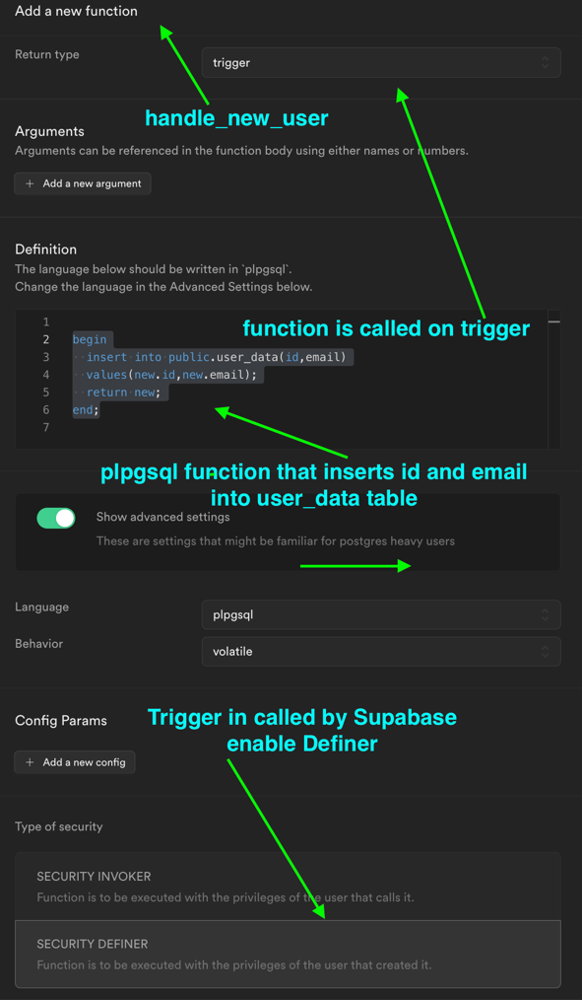
  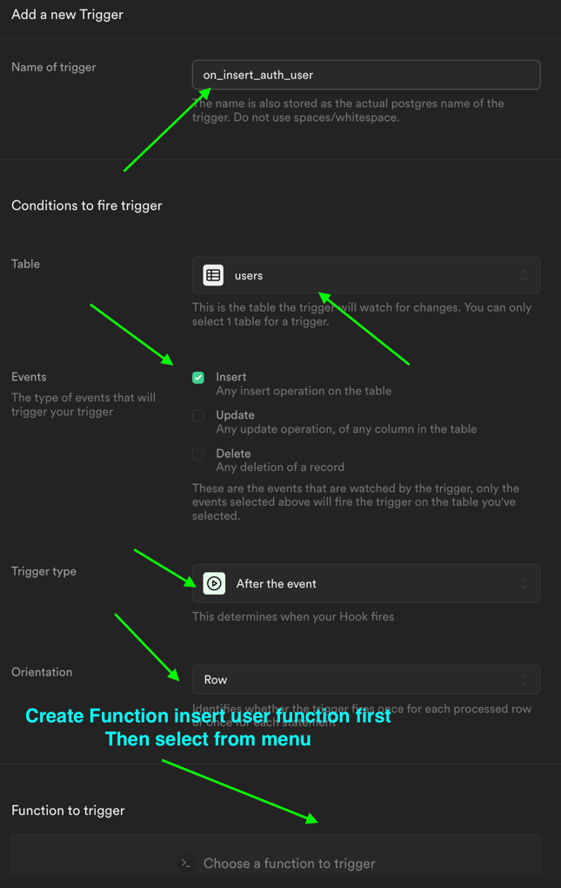 
</p>


#### SETTING UP FUNCTION + TIGGER IN SQL EDITOR

``` sql
create function public.handle_new_user()
returns trigger as
$$
begin
insert into public.user_data(id,email)
values(new.id,new.email);
return new;
end;
```

``` sql
$$
language plpgsql security definer;
```

``` sql
create trigger on_insert_auth_user
after insert on auth.users
for each row
execute procedure public.handle_new_user();
```

## Removing user data to triggers, functions, Edge functions
⦁	REMOVE all the user data from the supabase including the user before testing the trigger

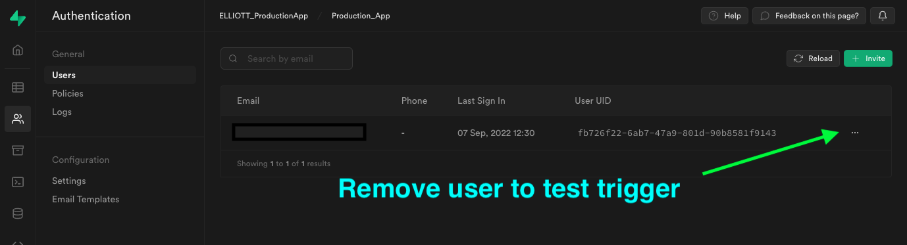

⦁	RUN npm run dev 
⦁	If everything is working properly after signing in to the remix app. A user with user_id will be written into the user_data base with stripe_customer null. 

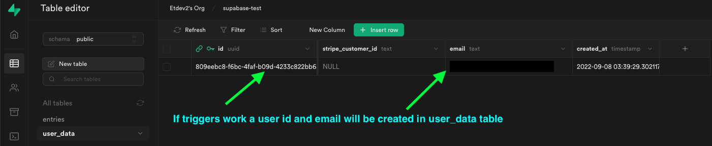

## SETUP STORAGE 
⦁	Create a new storage bucket named assets
⦁	Allow all operations 
⦁	Added the below definitions in Storage policies

``` sql
bucket_id = 'assets'
and auth.uid()::text = (storage.foldername(name))[1]
```

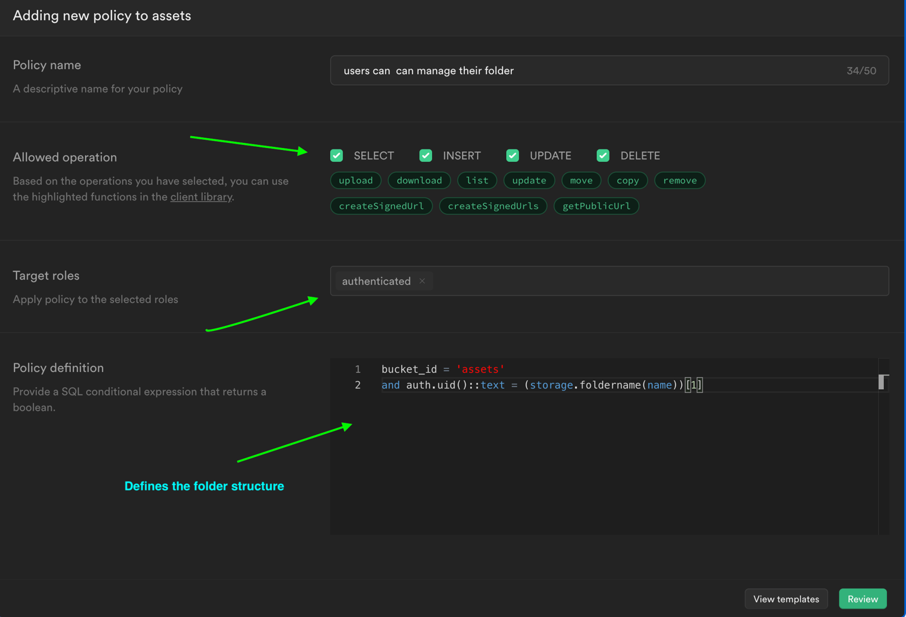

Storage File Structure Defined by policy 

Assets/
	/user uuid 
		/ entries  uuid
			/supabeats.mp3

	/user2 uuid 
		/entries uuid
			Dog-pic.png

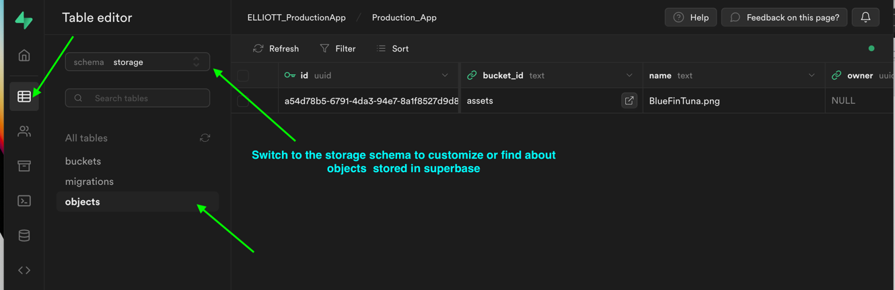

## SUPABASE EDGE FUNCTIONS AND SUPABASE CLI 
#### (Run Code In Vscode Terminal Exclude Run In The Terminal)

### STEPS TO THE EDGE
Follow the steps below are more detailed (You will have to mess around with things because sometimes the functions will not work as expected when adding **DATABASE WEBHOOKS**)

⦁	If you forked or cloned happy-days repository. Then Remove index.ts from the supabase folder, place it somewhere or copy code from the clipboard.

**(Run the following in the terminal)**

⦁	supabase init 
⦁	supabase link
⦁	supabase functions new create-stripe-customer
⦁	supabase functions deploy create-stripe-customer
⦁	curl -L -X POST invoke the function
⦁	Create database webhook in supabase
⦁	Add back the code form index.ts from the create-stripe-custom folder
⦁	Deploy supabase edge function again 
⦁	If there are users in the database, delete users.  
⦁	Npm run dev  and login 
⦁	If the user is found in user_data with stripe_customer_id = null triggers are working continue and remove all user data from auth and user_data table again.
⦁	Kill server
⦁	supabase secretes list 
⦁	supabase secrets set **STRIPE_KEY = sk_13234**
⦁	supabase secretes list again and check 
⦁	Copy code from code in supabase/functions/index from Happys-14 repo (the first function on top of index starts with  const stripe = stripe(Deno.env.get....)
⦁	supabase functions deploy create-stripe-customer
⦁	Finally, npm run dev, start server, log in. If no errors everything probably works, check in supabase dashboard in the user_data table to see if the user was created with a stripe_customer_id, if yes, then a customer will be inserted into the stripe dashboard. 

[Supabase CLI Guide](https://supabase.com/docs/guides/cli)

⦁	Move temperately create-stripe-customer out of the superbase file before creating the edge function.
⦁	RUN **supabase INIT**
⦁	RUN **supabase link --project-ref [Project-ref]**  
⦁	After linking the project you can exclude your project ref when deploying the edge function 
⦁	RUN **supabase functions new create-stripe-customer** (Creates)
⦁	RUN **supabase functions deploy create-stripe-customer --project-ref [project-ref] ** (deploys)

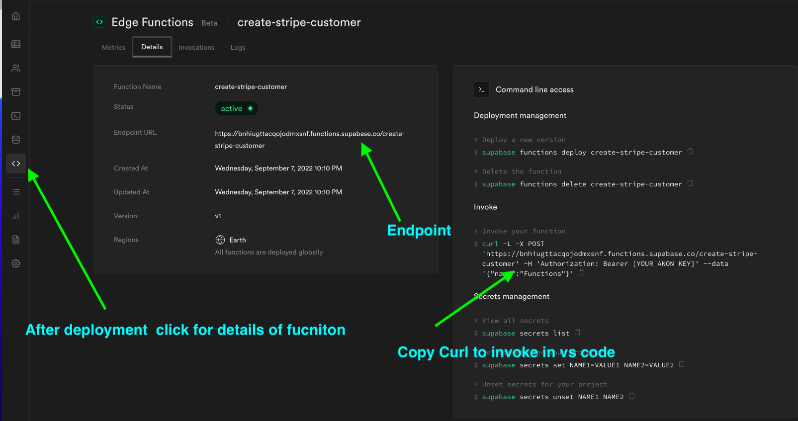

⦁	RUN **curl -L -X POST 'https:// [project-ref].functions.supabase.co/create-stripe-customer' -H 'Authorization: Bearer Anon_Key --data '{"name":"Functions"}' ** (Invokes)

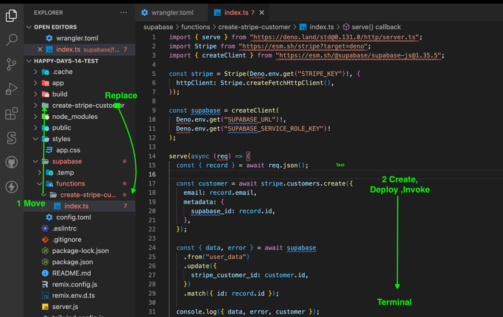

⦁	Replace  the create-stripe-customer folder, that was moved earlier in vs code 

## CREATE A STRIPE SECRETE KEY THAT CAN BE CALLED BY FUNCTION 
⦁	Create a stripe account 
⦁	In stripes developer dashboard copy secrete key

 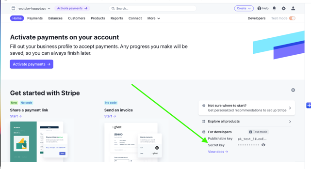
 
⦁	In vscode terminal Run: **supabase secrets list** (get a list of keys stored in supabase)
⦁	To set stripe key in Supabase Run: **supabase secrets set STRIPE_KEY =sk_1234** in terminal
⦁	Run: **supabase secrets list** to check if stripe key was stored

## CREATE A SUPABASE DATABASE WEBHOOK 

⦁	Setting up this webhook, there is you could run into problems, I don’t know why but I had issues, getting everything to get these working. Everything was right but a customer stripe id would not be created. So you may need to tweak things around
⦁	Create a webhook to call the Edge function that will create a stripe customer in stripe and in supabase when a new user is inserted into the database.
⦁	Delete user_data run npm run dev, login and if everything works you should have created a stripe customer in user_data and stripe dashboard

<p style="display: flex;">
  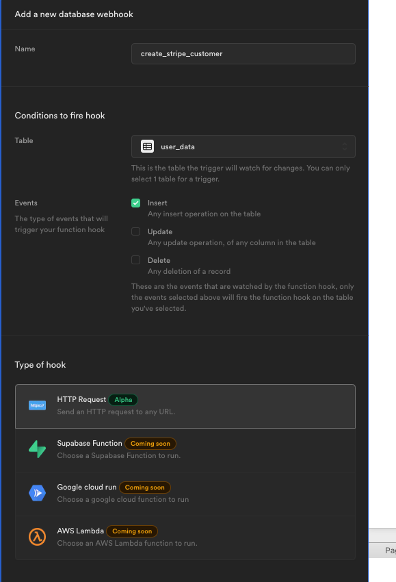
  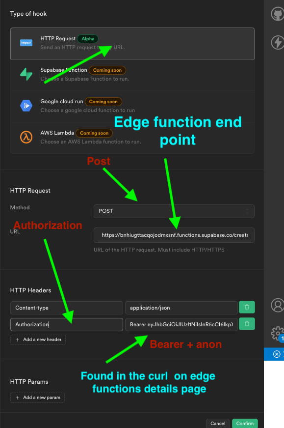 
</p>

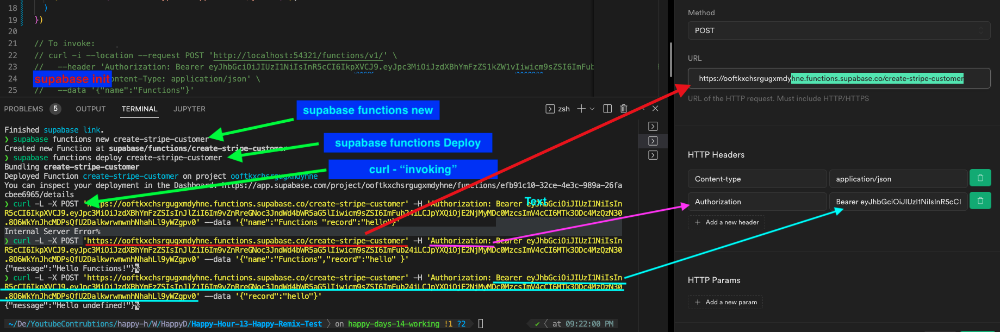


## MORE STRIPE

#### ADD STRIPEPRODUCT
⦁	Free/standard/premium
⦁	RECURRING MONTHLY
⦁	$0 / $4.99/ $9.99


#### Environment Variables, keys, and things 
(FILL OUT THESE use as clipboard)

*__Supabase__*
**SUPABASE_PROJECT_REF=**
**SUPABASE_URL =**
**SUPABASE_ANON_KEY=**

*___GITHUB___*
**CLIENT ID=**
**SECRET=**


### Supabase variables used by Edge functions
(Set in the terminal with supabase secretes set name2=value)
⦁	Supabase secrets set STRIPE_SIGNING_SECRET=
⦁	supabase secrets set STRIPE _KEY=
**.env**
(set in a .env in root)
**STRIPE_SECRET=**

*___wrangler.toml___*

**SUPABASE_URL =**
**SUPABASE_ANON_KEY=**


#### Supabase Edge functions 
supabase functions new  create-stripe-customer  
create-stripe-customer _URL =

supabase functions new  create-stripe-checkout  
create-stripe-checkout _URL =

supabase functions new stripe-webhooks. 
create-stripe-webhooks _URL =
